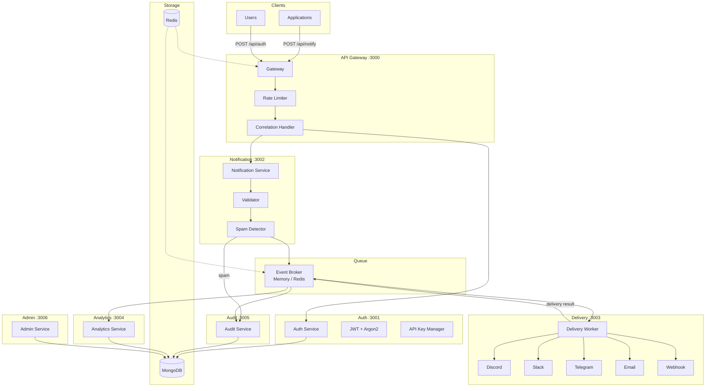
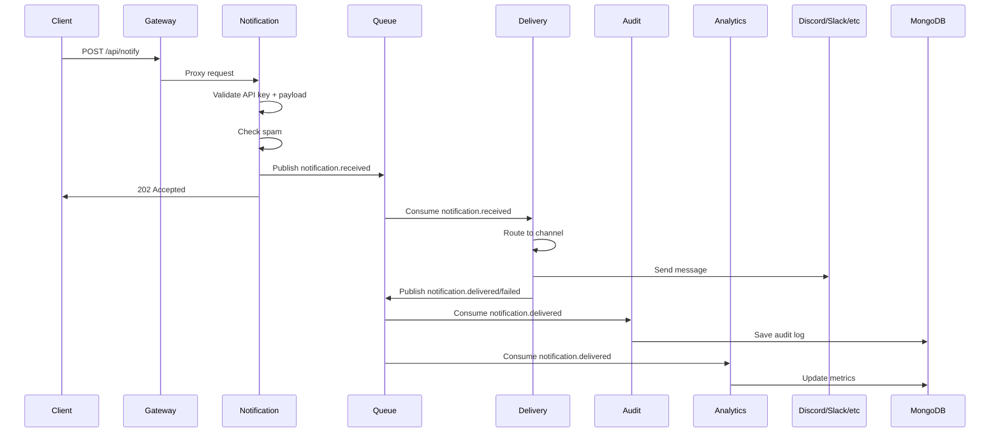

<div align="center">

# NotifyX

### Enterprise Multi-Channel Notification Platform

[](https://github.com/MahmoudAssaf47)
[](https://www.typescriptlang.org/)
[](https://nodejs.org/)
[](https://expressjs.com/)
[](https://www.mongodb.com/)
[](https://redis.io/)
[](https://docker.com/)
[](https://turbo.build/)
[](LICENSE)

---

**Created by [Mahmoud Assaf](https://github.com/MahmoudAssaf47)**

</div>

## Overview

NotifyX is a **microservices-based enterprise notification platform** that provides a single integration point for sending notifications across multiple channels. Built with TypeScript and designed for scalability, it handles authentication, rate limiting, spam detection, delivery routing, audit logging, and analytics.

### Key Features

- **Multi-Channel Delivery** — Discord, Slack, Telegram, Email, and Custom Webhooks
- **JWT Authentication** — Secure access with refresh token rotation
- **API Key Management** — Scoped keys with granular permissions
- **Spam Detection** — Keyword filtering and script injection prevention
- **Audit Trail** — Complete delivery history with search and filtering
- **Analytics** — Per-application and per-channel delivery metrics
- **Event-Driven** — Async processing via pub/sub queue
- **Rate Limiting** — IP-based and API-level rate control
- **Correlation Tracking** — End-to-end request tracing across services
- **Docker Support** — Containerized deployment with Docker Compose

## Architecture



## Microservices

| Service | Port | Responsibility |
|---------|------|----------------|
| **Gateway** | `3000` | API gateway, rate limiting, request routing, correlation IDs |
| **Auth** | `3001` | User registration, login, JWT tokens, API key management |
| **Notification** | `3002` | Receive notifications, validate payloads, spam detection |
| **Delivery** | — | Route and send notifications to configured channels (no HTTP) |
| **Analytics** | `3004` | Track delivery success/failure metrics per app and channel |
| **Audit** | `3005` | Record all events (delivery, auth, security) with search |
| **Admin** | `3006` | Application configuration management |

## Tech Stack

| Category | Technology |
|----------|------------|
| Language | TypeScript 5.4 (strict mode) |
| Runtime | Node.js 22+ |
| Framework | Express.js 5 |
| Database | MongoDB 7 + Mongoose |
| Cache/Queue | Redis 7 / In-Memory fallback |
| Queue Client | BullMQ |
| Auth | JWT + Argon2id |
| Validation | Zod |
| Monitoring | Correlation IDs, structured JSON logging |
| Dev Tools | Turborepo, tsx, ESLint, Prettier |

## Project Structure

```
notifyx/
├── apps/
│   ├── notifyx-gateway/           # API Gateway
│   ├── notifyx-auth-service/      # Authentication Service
│   ├── notifyx-notification-service/ # Notification Handler
│   ├── notifyx-delivery-service/  # Channel Delivery Worker
│   ├── notifyx-audit-service/     # Audit Logging Service
│   ├── notifyx-analytics-service/ # Analytics & Metrics
│   └── notifyx-admin-service/     # Admin Configuration
├── packages/
│   └── notifyx-shared/            # Shared types, models, utilities
├── docker/                        # Dockerfiles per service
├── docs/                          # Documentation
├── .github/                       # CI/CD & templates
├── docker-compose.yml
└── package.json                   # Turborepo monorepo root
```

## Quick Start

### Prerequisites

- Node.js >= 22
- MongoDB >= 7 (or Docker)
- Redis >= 7 (optional, in-memory fallback available)

### Local Development

```bash
# 1. Clone
git clone https://github.com/MahmoudAssaf47/notifyx.git
cd notifyx

# 2. Install dependencies
npm install

# 3. Copy environment file
cp .env.example .env
# Edit .env with your configuration

# 4. Start all services
npm run dev
```

### Docker Deployment

```bash
# Start all services with dependencies
docker compose up -d

# Check service health
curl http://localhost:8080/health

# View logs
docker compose logs -f
```

## API Examples

### Authentication

```bash
# Register a new user
curl -X POST http://localhost:8080/api/auth/register \
  -H "Content-Type: application/json" \
  -d '{"email":"user@example.com","password":"securepass123","name":"John Doe"}'

# Login
curl -X POST http://localhost:8080/api/auth/login \
  -H "Content-Type: application/json" \
  -d '{"email":"user@example.com","password":"securepass123"}'

# Response includes access + refresh tokens
```

### Send Notification

```bash
curl -X POST http://localhost:8080/api/notify \
  -H "Content-Type: application/json" \
  -H "x-api-key: ak_live_your_api_key_here" \
  -d '{
    "channel": "discord",
    "body": "Hello from NotifyX!",
    "subject": "Test Notification",
    "sender": {"name": "My App", "email": "app@example.com"}
  }'
```

### Create API Key

```bash
curl -X POST http://localhost:8080/api/auth/keys \
  -H "Content-Type: application/json" \
  -H "Authorization: Bearer <your_jwt_token>" \
  -d '{"appName":"MyApp","permissions":["notify:send"],"expiresInDays":30}'
```

## Event Flow



## Environment Variables

Key variables (see `.env.example` for full list):

| Variable | Required | Description |
|----------|----------|-------------|
| `JWT_SECRET` | Yes | JWT signing key (min 32 chars) |
| `REFRESH_SECRET` | Yes | Refresh token signing key (min 32 chars) |
| `ADMIN_API_KEY` | Yes | Separate key for admin endpoints |
| `MONGODB_URI` | Yes | MongoDB connection string |
| `REDIS_URL` | No | Redis URL (in-memory fallback) |

## Performance

- **API Key Lookup**: O(1) using Map-based key index
- **Database Indexes**: Indexed on common query patterns (app, channel, status, createdAt)
- **Connection Pooling**: Configured per service via Mongoose
- **Async Processing**: Queue-based delivery (non-blocking)

## Security

- **Password Hashing**: Argon2id with tuned parameters
- **JWT**: Short-lived tokens with secure secrets
- **API Keys**: Hashed with SHA-256, shown once at creation
- **SMTP Credentials**: Encrypted at rest in MongoDB (AES-256-CBC)
- **Rate Limiting**: Global and per-endpoint limits
- **Helmet**: Security headers on gateway
- **Audit Logging**: All auth events recorded
- **Admin Separation**: Dedicated admin API key

## Author

<div align="center">

### Mahmoud Assaf

**Backend Engineer | TypeScript Developer | Microservices Enthusiast | Open Source Developer**

[](https://github.com/MahmoudAssaf47)

</div>

## License

This project is licensed under the MIT License — see the [LICENSE](LICENSE) file for details.

---

<div align="center">
  <sub>Built with ❤️ by Mahmoud Assaf</sub>
</div>
