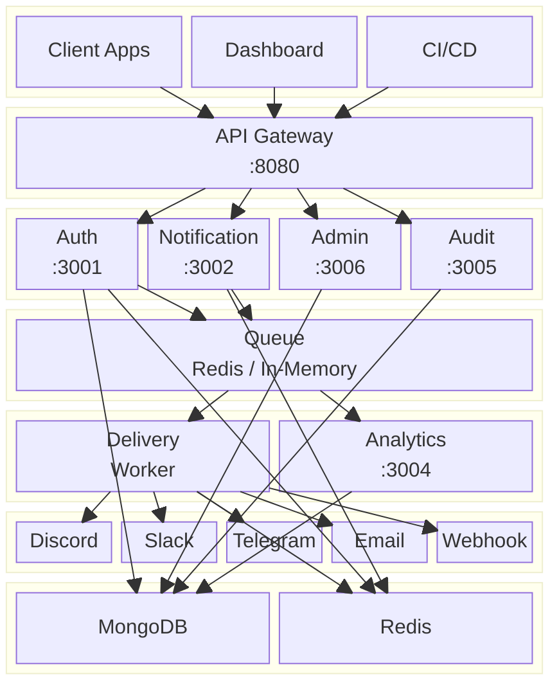
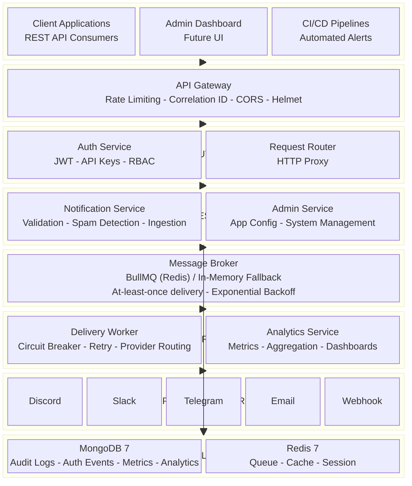
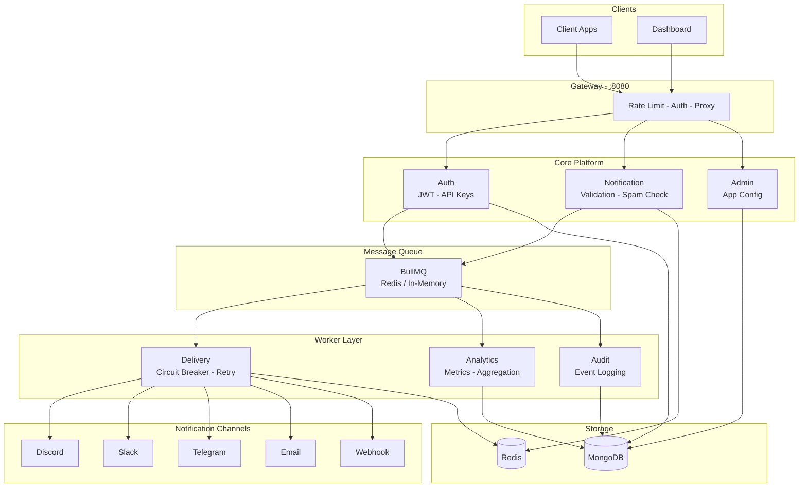
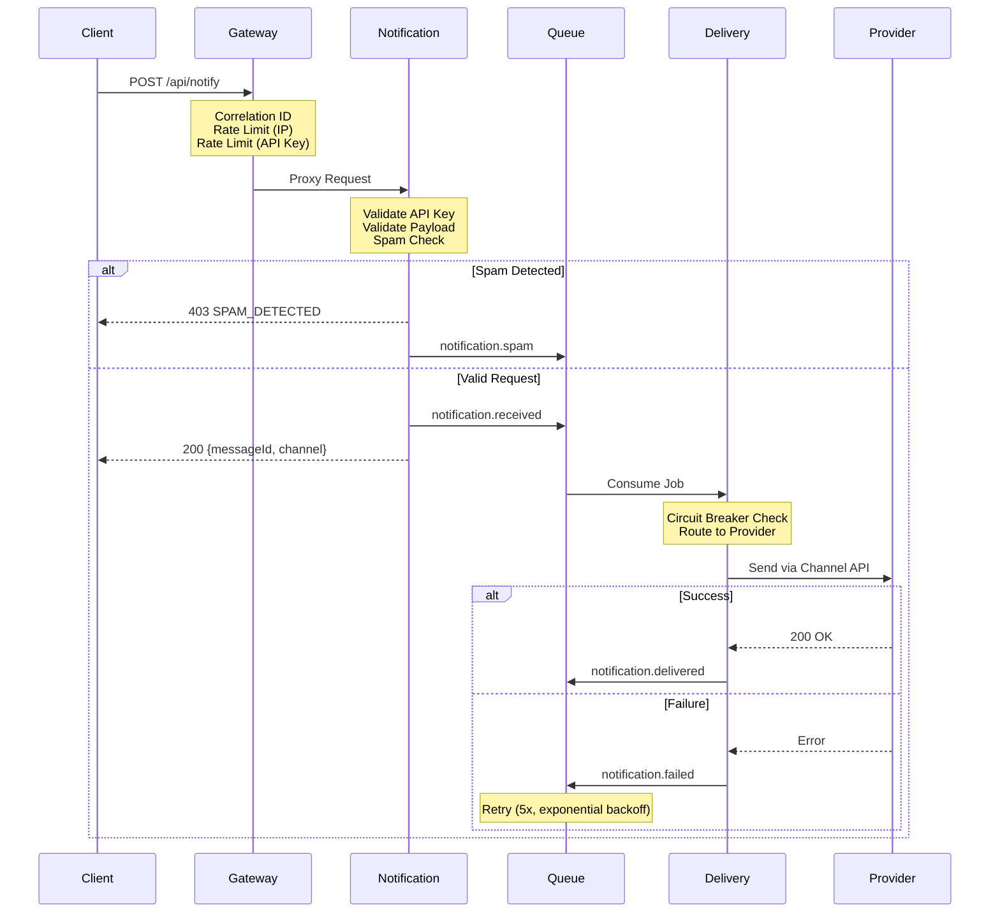
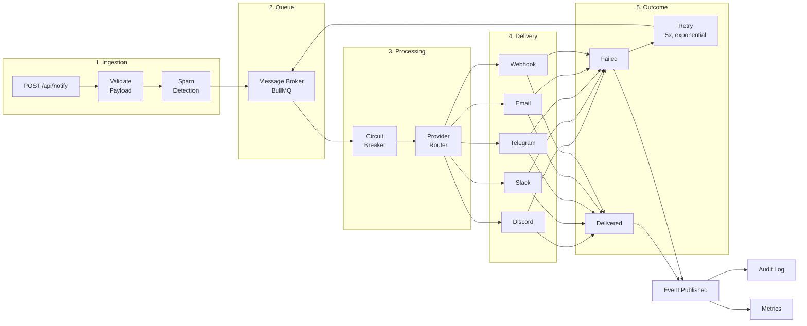
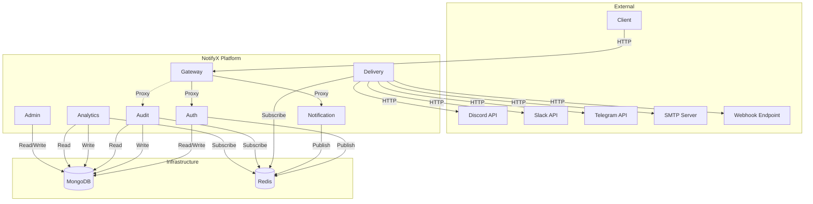
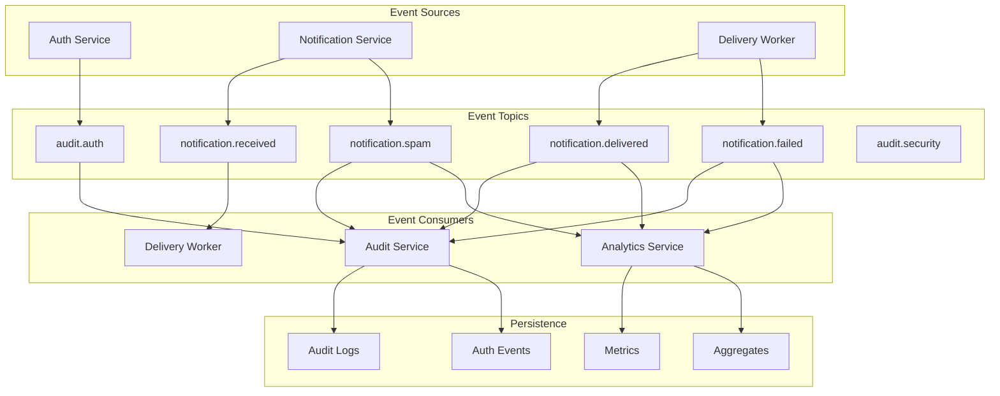
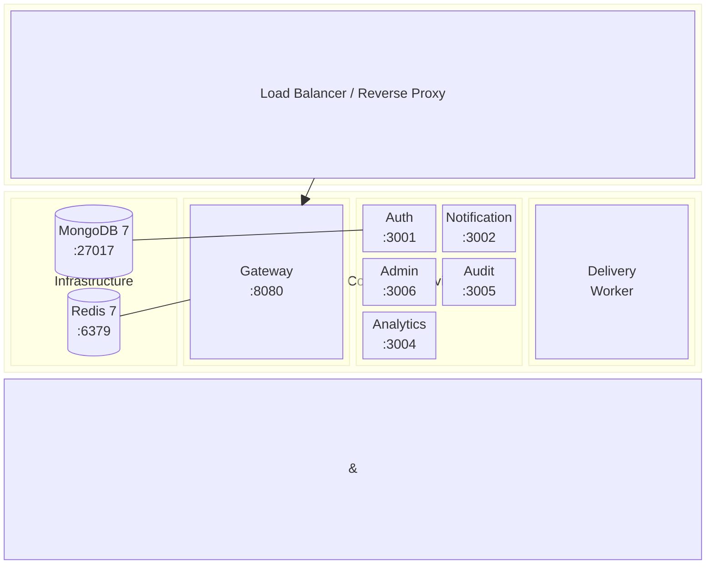

# Architecture

> Enterprise multi-channel notification platform built with TypeScript microservices.

## System Overview

---

## Architecture Layers

---

## Simplified Architecture (README)

---

## Request Lifecycle

---

## Notification Delivery Pipeline

---

## Service Dependency Map

---

## Event Flow

---

## Deployment Architecture

---

## Architecture Review — Findings

### Identified Issues

| # | Issue | Severity | Recommendation |
|---|-------|----------|----------------|
| 1 | **Dual API key systems** — Auth Service manages `nx_` keys in MongoDB; Notification Service uses `DISPATCH_*` env vars with `ak_live_` keys | Medium | Unify to a single API key store. Use MongoDB for runtime key management. |
| 2 | **Admin Service not proxied** — Admin Service (3006) is separate from Gateway | Low | Intentional design — admin endpoints use different auth. Acceptable. |
| 3 | **`audit.security` topic never published** — Subscribed but no publisher exists | Low | Wire SecurityEvent publishing in Auth Service or Gateway. |
| 4 | **Message model unused** — Defined in shared but never written to | Low | Remove or repurpose. Currently AuditLog serves this function. |
| 5 | **Cache subsystem unused** — Exported from shared but never called | Low | Use for API key validation, rate limiting, or session caching. |
| 6 | **Duplicated auth middleware** — Audit and Analytics implement their own `requireAdmin` inline | Medium | Extract to shared package for consistency. |
| 7 | **AppConfig dual config** — MongoDB `app_configs` (Admin) and env-based config (Notification/Delivery) are not synchronized | Medium | Choose one source of truth. Recommended: MongoDB with env fallback. |
| 8 | **No integration tests** — Only 2 test files exist (8 test cases total) | High | Add integration tests for notification pipeline and auth flows. |

### Strengths

| # | Strength |
|---|----------|
| 1 | Clean event-driven architecture with well-defined topics |
| 2 | Circuit breaker pattern for provider resilience |
| 3 | Structured logging with correlation ID propagation via AsyncLocalStorage |
| 4 | Graceful fallback from Redis to in-memory queue/cache |
| 5 | Multi-stage Docker builds with Alpine images |
| 6 | Health check endpoints on all HTTP services |
| 7 | Monorepo with Turborepo for efficient builds |
| 8 | Comprehensive documentation (API, Database, Events, Deployment) |

---

## Port Reference

| Service | Port | Protocol |
|---------|------|----------|
| Gateway | 8080 | HTTP |
| Auth Service | 3001 | HTTP |
| Notification Service | 3002 | HTTP |
| Delivery Worker | — | No HTTP (queue consumer) |
| Analytics Service | 3004 | HTTP |
| Audit Service | 3005 | HTTP |
| Admin Service | 3006 | HTTP |
| MongoDB | 27017 | TCP |
| Redis | 6379 | TCP |

---

## Technology Stack

| Layer | Technology | Purpose |
|-------|-----------|---------|
| Runtime | Node.js 22 | Server runtime |
| Language | TypeScript 5.4 | Type safety |
| Framework | Express 5 | HTTP framework |
| Queue | BullMQ (Redis) | Message queue with retries |
| Database | MongoDB 7 | Document store |
| Cache | Redis 7 / In-memory | Caching layer |
| Auth | JWT + argon2id | Authentication |
| Validation | Zod | Schema validation |
| Monorepo | Turborepo | Build orchestration |
| Container | Docker Compose | Deployment |
| Testing | Vitest | Unit testing |
